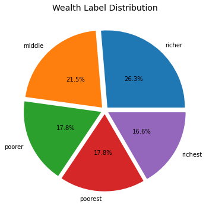
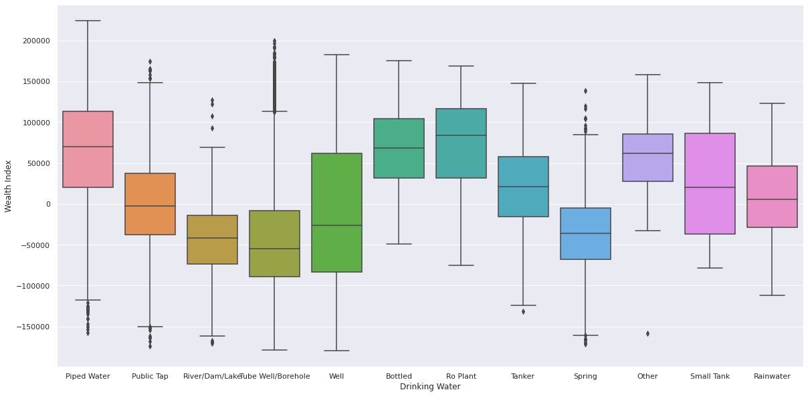
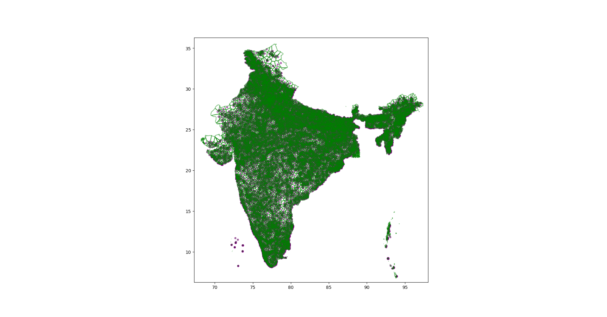
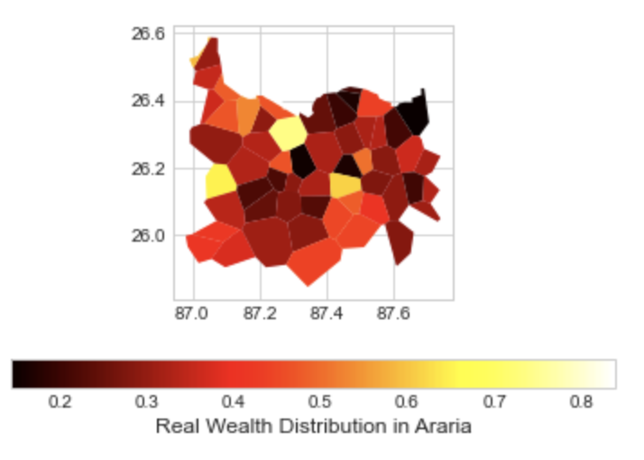
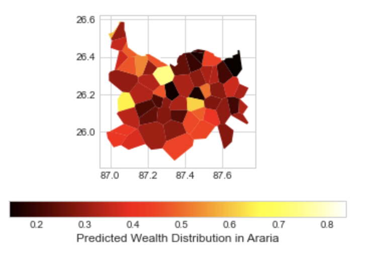
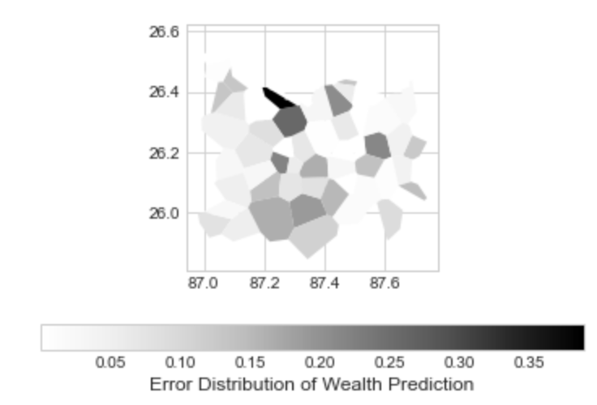

[](https://github.com/psf/black)
[](https://opensource.org/licenses/MIT)
[](https://github.com/cmougan/WRI_WellBeing_Data_Layer)

# WRI Creating a well-being data layer.

This project contains the code, papers, and deliverables for the [DSSG project](https://www.solveforgood.org/) with the [World Resources Institute (WRI)](https://www.wri.org/)
 *Creating a well-being data layer using machine learning, satellite imagery, and ground-truth data* [link](https://www.solveforgood.org/proj/47/)

In the long term, we are building a tool that can be extended to predict the wealth and economic factors of any given area in India.
More information on the architecture and implementation is given below.

# Table of contents

- [Project-Scope](#Project-Scope)
- [The Data](#The-Data)

  - [Demographic Health Survey](#Demographic-Health-Surveys)
  - [Open Street Maps Data](#Open-Street-Maps-Data)
  - [Night-Time Light Data](#Night-Time-Light-Data)
- [Project Methodology](#Project-Methodology)

  - [Data Preparation](#Data-Preparation)
  - [Evaluation Strategy](#Evaluation-Strategy)
  - [Label Transformation](#Label-Transformation)
  - [Explainable Machine learning pipeline](#Explainable-Machine-Learning-Pipeline)
- [Results](#Results)

  - [Conclusions](#Conclusions)
  - [Deliverables](#Deliverables)
  - [Future Work](#Future-Work)
- [Development](#development)

  - [Getting Started](#getting-started)
  - [Main Components](#main-components)
  - [Contribution Guidelines](#contribution-guidelines)
- [Project Organization](#Project-Organization)
- [Bibliography](#Bibliography)

## Project Scope

Conducting economic surveys requires huge resources; thus, modern means of acquiring this information using publicly available data and open source technologies create the possibilities of replacing current processes.
Satellite images can act as a proxy for existing data collection techniques such as surveys and census to predict the economic well-being of a region.

The project aims to propose an alternative to Demographic Health Surveys using open-source data such as Open Street Map, Sentinel, and Night Light data.

## The Data

### Demographic Health Surveys

Demographic Health Surveys collect information on population, health, and nutrition for each state and union territory.
They are jointly funded by the United States Agency for International Development (USAID), the United Kingdom Department for International Development (DFID), the Bill and Melinda Gates Foundation (BMGF), and the United Nations. The datasets used in this project were obtained from the [dhsprogram](https://dhsprogram.com/) website.

The dataset was explored manually as well as through [Pandas Profiling library](https://github.com/pandas-profiling/pandas-profiling). 
||
|:--:|

Box and Violin plots were used to make the following observations:

- Wealth index had almost a perfectly linear normal distribution.
- Population density was found to have a positive correlation with the wealth index.
- Wealth and electricity usage are correlated.(Figure 1)
- The distribution of roof materials is highly diffused (Figure 2). 
- Richer families prefer flush toilets (Figure 3).
- The distribution of water source is highly diffused (Figure 4). 

||
|:--:|
|Figure 1: Richer families have electricity|

||
|:--:|
|Figure 2: Choice of roof material is highly diffused.|

||
|:--:|
|Figure 3: Richer families use flush-toilets|

||
|:--:|
|Figure 4: Water Sources Are Highly Diffused|

The figures above visualize the different wealth distributions on several categorical features found on the dataset.

All the images are available in images folder and in the [(DSSG/WRI) DHS Analysis.ipynb](./(DSSG_WRI)_DHS_Analysis.ipynb) notebook


### Open Street Maps Data

OpenStreetMap (OSM) is an open-source project that crowd-sources the world map and has made it available free of cost. OSM compares to the traditional map provider data and is often considered as good or better than what is commercially available, as reported [here](https://mapbox.github.io/osm-analysis-collab/osm-quality).

A python module [osm_data_extraction](./dssg/dataio/osm_data_extraction.py) was implemented to extract OSM data given the [GADM, Level 3](https://gadm.org/download_country_v3.html) shapefile and a district name. The module uses [OSMNx](https://github.com/gboeing/osmnx) which interacts with the OpenStreetMap's API to get the relevant data for a specific region and stores it in a csv file. An example usage of this module can be found in the notebook [araria_district.ipynb](./dssg/data-exploration/araria_district.ipynb).

Due to computing resource constraints, the analysis has been restricted to the Araria district of Bihar state.
### Night-Time Light Data

Night-time light (NTL) data can highlight areas of higher economic activity as these regions tend to be relatively more lit.

Image data to explore this approach was obtained via Google Earth Engine (GEE). GEE provides a quickly accessible collection of data images captured across timelines, lightwave lengths, and satellite systems.

The data is open and free to use for non-commercial use cases. The first approach of this project explored the usefulness of the GEE interface and the monthly NTL images (from the mines dataset <a href="#ref3">[3]</a>

The second approach looked at another data stream (NASA Black Marble <a href="#ref4">[4]</a> to look at the daily variability of the data. 
Both approaches were useful to gain an understanding of the different flavors of NTL data, and how these data sources could be utilized in future projects.

A python module [ntl_data_extraction](./dssg/data/ntl_data_extraction.py) and a command-line app [download-nightlights](./dssg/apps/download-nightlights.py) were implemented to download the night light data for a given district and the date range.
The implementation uses the [modapsclient](https://pypi.org/project/modapsclient/), a RESTful client for NASA's MODIS Adaptive Processing System (MODAPS). The python module also implements a method to convert the hdf5 files to GeoTiff files for further processing. After conversion, from hdr (native format) to GeoTIFF, the daily NTL intensity tiles are available for processing. The project area (Continental India) is covered by 7 (or 8) tiles of 10x10 degrees, or 2400x2400 cells. To match the temporal window of the project (2013-2017, 2 years around the DHS 2015 census for India) the total NTL data repository would be more than 1825 data layers (4MB per HDR / 10MB per GeoTiff images).
The difference in disk size between HDR and GeoTIFF is due to compression and data type, HDR files are optimized for storage, and will contain besides the light intensity values also the data quality
flags. The team used NASA’s VIIRS/NPP LunarBRDF-Adjusted Nighttime Lights data with a spatial resolution of 500m.

The data was explored but due to a pressing need for computational resources and time, the data was not integrated with the other data sources and hence not utilized for solution building. We also concluded that for future computations it would be better to use annual composites of the night light data sets from the mines data repository [3], to reduce the need for large amounts of computational resources.

The implementation of the `osm_data_extraction` and `ntl_data_extraction` modules would be crucial to scaling the data processing pipeline for the rest of India or any other country in the world.

## Project Methodology

### Data Preparation

Socio-economic indicators are important measures to assess spatial or societal dimensions.
Although DHS data collected by governmental and non-governmental organizations are reliable and comprehensive choices to describe societal phenomena they are available only at certain years intervals for India.
In this project, a machine learning-based approach is used to predict the wealth index from OSM data based on DHS data as the ground truth.

[**Voronoi Tessellations**](https://en.wikipedia.org/wiki/Voronoi_diagram) appeared in the classic treatise of Snow on the 1854 cholera epidemic in London in which he demonstrated that proximity to a particular well was strongly correlated to deaths due to the disease.
It continues to be a very useful tool to study demographics, territorial systems, and accurate estimates of average rainfall in a region among other applications. 
In our case, we use a generalization of Voronoi Diagrams called **Laguerre-Voronoi Tessellations**,  famously known as [Power Diagrams](https://en.wikipedia.org/wiki/Power_diagram) to tessellate the DHS dataset [IAGE71FL.zip](https://dhsprogram.com/data/dataset/India_Standard-DHS_2015.cfm). 
Laguerre Voronoi diagrams partition the Euclidean plane into polygonal cells defined from a set of circles.  
The motivation behind using this specific generalization comes from the peculiarity of the DHS data. 
DHS surveys contain confidential information that could potentially be used to identify an individual through unique information. 
To avoid this in all DHS surveys the center GPS coordinate of the populated place in a cluster is recorded and separate degradation error values, a random error of 5 km maximum in rural areas and 2 km maximum in urban areas is applied. 
All the details of the implementation of this tessellation on the DHS data can be found in the following places:

* [GitHub Gist : 2d Laguerre-Voronoi diagrams](https://gist.github.com/sunayana/a3a564058e97752f726ca65d56fab529)
* [gis-laguerre : Applications of Laguerre-Voronoi to GIS problems](https://github.com/dai-mo/gis-laguerre)
* [Data Preparation for Geospatial Analysis & ML with Laguerre-Voronoi in Python](https://towardsdatascience.com/data-preparation-for-geospatial-analysis-ml-with-laguerre-voronoi-in-python-71b9b418d8b6)

||
|:--:|

**Combine DHS and OSM Data**: In the next step we combine the weighted Voronoi GeoDataFrame specific to a district with the OSM vector data of the same district using the following strategy:

* Every Voronoi cell has a unique DHS cluster id.
* Any point in the OSM vector data gets the DHS cluster-id depending on the Voronoi cell it belongs to.
* Any polygon from the OSM vector data gets the cluster id of the Voronoi cell it is contained in.
* Any polyline from the OSM vector data is split into several line segments belonging to different Voronoi cells and these line segments get the DHS cluster-id depending on the Voronoi cell they belong to.

  This pipeline was partially implemented in the [araria_voronoi.ipynb](./dssg/araria_voronoi.ipynb) notebook.

**Combine DHS and NTL Data**: Similar to the techniques used to match the OSM data to DHS clusters, a method will have to be developed to aggregate the NTL to the appropriate DHS cluster. It is recommended to use the same weighted Vonoroi polygons when doing the "Zonal Statistics"; a spatial operation designed to retrieve key statistics by area (polygons) from raster images.

### Evaluation Strategy

We tend to judge a model's generalization error by the gap between its performance in training and test <a href="#ref5">[5]</a>.
For this matter, it's important to strategically partition a dataset in a way that resembles what happens in the desired production environment.
Due to the few samples in the dataset restrictions, we performed a Leave One Out evaluation (LOOCV).
Leave-one-out cross-validation, or LOOCV, is a configuration of k-fold cross-validation where k is set to the number of examples in the dataset.

||
|:--:|

LOOCV is a computationally expensive procedure to perform,
although it results in a reliable and unbiased estimate of model performance.

### Label Transformation.

The original wealth index provided by the DHS data was a classification between 1-5 of the wealth level of a certain district.
`{1: Poorest  2: Poorer 3: Middle 4: Richer 5: Richest}`
This label even if at first might seem a multiclassification is a continuous feature that has been post-processed and binarized into categories.

We treat this problem as a regression task that then needs to be binarized again in the post-processing part of the ML pipeline.
In the meanwhile, we use the Mean Absolute Error as an intuitive evaluation metric.

We standardized the label to have it between [0-1], for sake of dimensionality.

||
|:--:|

In the above image, for the Araria district, we can see the scaled label. 0 being poor and 1 rich.
There is a Voronoi region within the Araria district that has a higher wealth than the rest.

### Explainable Machine learning pipeline

Due to the possible impact of this project on public policy, we advocate for an explainable ML approach <a href="#ref6">[6]</a>.

||
|:--:|

For the modeling part a set of experiments to determine the most reasonable machine learning estimator was performed.
The selected estimator for this part of the project was a decision tree, due to its performance
 and given that the data we are working with at this stage is relatively small.
This model also allows us to understand how the ML decisions are made.

## Results

After preprocessing the data the following results were obtained.
||
|:--:|

||
|:--:|

In the difference of wealth distribution, we can see where our model is achieving the best results and where it's failing.
This visualization can help to gain trust in the model since metrics do not always give users an understanding of a model's performance.

We can note in the heatmap that most of the errors are between [0.1,0.2]%. This percentual error in the predictions is low and provides preliminary evidence that a model should be able to perform with a high enough quality with a larger dataset.

### Conclusions

Predictive Model that is:

1. Open Source Data
2. Does not require cloud computing resources

Modeling remains explainable and accountable while preserving accuracy

1. Explainable and Interpretable machine learning
2. Accountable. It should be possible to trace the logical reasons why a decision was taken.
3. High Generalization: Simple models tend to have a higher generalization than complex models <a href="#ref1">[1]</a>

### Deliverables

The project had the following deliverables:

1. Project final [presentation](https://github.com/cmougan/WRI_WellBeing_Data_Layer/blob/master/Deliverables/Presentation.pdf)
2. A report with an extensive analysis of the methodology followed.
3. A separate module of the weighted Voronoi implementation in [gis-laguerre](https://github.com/dai-mo/gis-laguerre)
4. A corresponding article on weighted Voronoi for knowledge dissemination in [Towards Data Science](https://towardsdatascience.com/data-preparation-for-geospatial-analysis-ml-with-laguerre-voronoi-in-python-71b9b418d8b6)

### Future Work

Future work steps:

1. Scaling Up: Due to the limitation of the computational resources we ended up working for only one district of India. Its performance on state and national levels remains to be evaluated.
2. Integrate with NTL: One further data integration that should be helpful is the Night Light Data,
 this data theoretically should improve the accuracy in areas where OSM data is scarce.
3. Temporal Evaluation: As the goal of the project, is to prevent what will happen in the future with forests, there is the need to ensure that the model will generalize as time goes by.


## Development

### Getting Started
The instructions here will get your development environment setup for this project.

#### Prerequisites
To build this project you need
- To clone this GitHub repository 
- Then for Linux / MacOS environments set the PYTHONPATH to the directory of the Gist above.
- If you do not have `pipenv` installed make sure to install it using the instructions found [here](https://pipenv-fork.readthedocs.io/en/latest/install.html) 

#### Installing
:warning: The project has to be forked to your own namespace before cloning. 

Clone the project:
```
$ git clone git@github.com:<your_user_name>/WRI_WellBeing_Data_Layer.git
```
Add [this](https://github.com/cmougan/WRI_WellBeing_Data_Layer) repository as a remote and name it `upstream`. Clone of your own fork is named `origin`.

For further instructions for setting up, please follow the steps [here](./dssg/README.md)
### Main Components
The main components are as follows:
- Module `osm_data_extraction`, which has the following features :
  - Extract GeoDataFrame of a district from a country GADM Level 2 shapefile.
  - Plots the boundary of a given district along with the corresponding map tile from Open Street Maps.
  - Retrieves and writes the map tile corresponding to the geo dataframe to a geotiff file.
  - Plots a geotiff file.
  - Creates the polygon and the corresponding graph for a given geo dataframe of a district. This is finally used to visualize the knots and edges model.
  - A dictionary of tags, `default_tags = {amenity': True, 'building': True, 'emergency': True,
                'highway': True, 'footway': True, 'landuse': True, 'water': True}` is used to extract relevant features and ammenities from the OSM API for a given district. 

- Module `ntl_data_extraction` and command line app `download-nightlights.py`
  - The command line app uses the methods in the module to download night time light hdf5 files for a given district and a specific time range and convert them to geotiff format. Since the hdf5 files cover a large area and may contain many districts we have added a check and it is downloaded only if it has not been downloaded earlier for another district. 
### Contribution Guidelines
In general we follow the [GitHub Forking Workflow](https://guides.github.com/activities/forking/)
#### On GitHub
- Create an issue for each new bug/feature/update/documentation that you want to contribute to. In the issue description, be as detailed as possible with the expected inputs, outputs and an outline of the process to solve the problem. In case of a bug add the steps needed to reproduce it.
- Assign someone to the issue and apply a specific tag to it (documentation, enhancement, bug, etc.).

#### On your local machine
- To start working on an issue create a separate branch :
```
git checkout -b feature/<branch_name>
```
if it is a feature or 
```
git checkout -b bugfix/<branch_name>
```
substitute the `<branch_name>` with a descriptive name.
- Once your work is done, commit and push:
```
git push -u origin feature/<branch_name>
```

#### Back on GitHub
- Once issue is solved, make a Pull Request (PR) on GitHub to merge to master branch and link the issue in the PR description and assign people to review your PR.
- Once the PR get approved and merged, delete the branch and close the issue. 
## Project Organization

### Solve For Good Collaborators

[Sunayana Ghosh](https://www.linkedin.com/in/sunayanag/) (Data Engineering & ML)

[Gijs van den Dool](https://www.linkedin.com/in/gvddool/) (GIS Expert & Data Engineering)

[Rohan Nadeem ](https://www.linkedin.com/in/rohaan-nadeem/) (Data Science)

[Carlos Mougan](https://www.linkedin.com/in/carlosmougan/) (Project Scoper/Manager)

### Word Resources Institute

[Rong Fang](https://www.linkedin.com/in/rongfang1/) (Scientist and Project Manager)

[Kathleen Buckingham](https://www.linkedin.com/in/kathleenbuckingham/) (Project Manager)

### Omdena

[Rehab Emam](https://www.linkedin.com/in/rehabemam228/) (Consultant)

[Precioso Gabrillo](https://www.linkedin.com/in/precioso-gabrillo-iii/) (Consultant)


## Bibliography

<ol> 
    <li is="ref1"> Stop explaining black box machine learning models for high stakes decisions and use interpretable models instead: https://www.nature.com/articles/s42256-019-0048-x</li>
    <li is="ref2">Interpretable Machine Learning: A Guide for Making Black Box Models Explainable https://christophm.github.io/interpretable-ml-book/</li>
    <li is="ref3">https://eogdata.mines.edu/products/vnl/</li>
    <li is="ref4">https://viirsland.gsfc.nasa.gov/Products/NASA/BlackMarble.html</li>
    <li is="ref5">The Mythos of Model Interpretability: https://arxiv.org/abs/1606.03490</li>
    <li is="ref6">Explainable Machine Learning for Public Policy: https://arxiv.org/pdf/2010.14374.pdf</li>
</ol>
