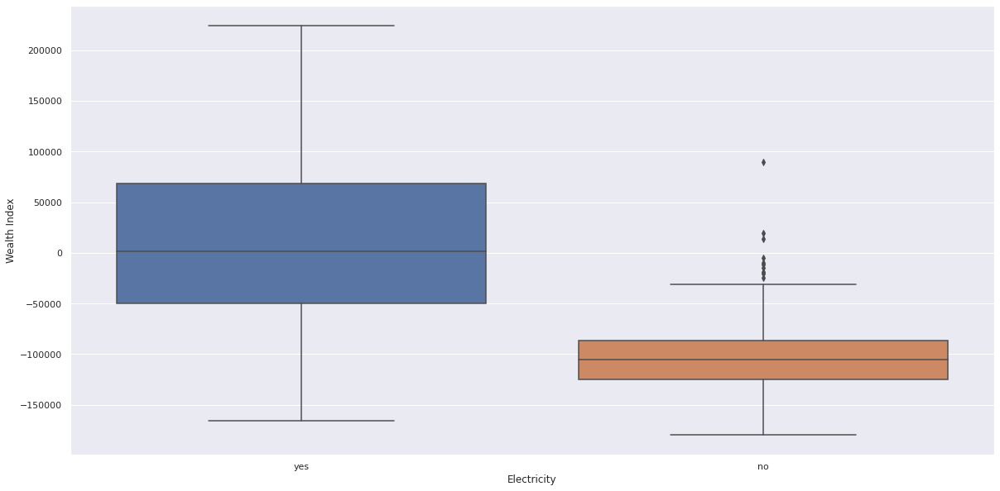
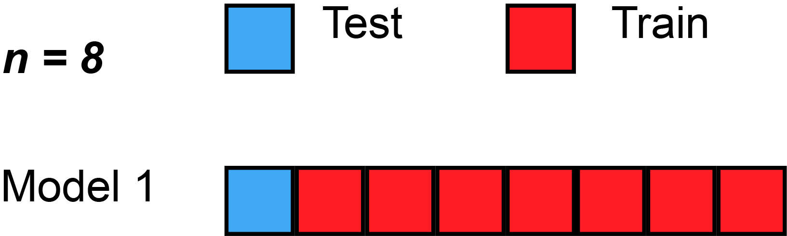

    
# WRI Creating a well-being data layer.

This project contains the code, papers and deliverables for the DSSG project *Creating a well-being data layer using machine learning, satellite imagery and ground-truth data*

In the long term, we are building a tool that can be extended to predict the wealth and economic factor of any given area in the world. 
More information on the architecture and implementation below.

# Table of contents
- [Project-Scope](#Project-Scope)

- [The Data](#The-Data)
    - [Demographic Health Survey](#Demographic-Health-Surveys)
    - [Open Street Maps Data](#Open-Street-Maps-Data)
    - [Night Time Light Data](#Night-Time-Light-Data)
    
- [Methodology](#Night-Time-Light-Data)
    - [Evaluation Strategy](#Evaluation-Strategy)
    - [Machine learning pipeline](#Machine-Learning-Pipeline)
  
 - [Results](#Results)
    - [Conclusions](#Conclusions)
    - [Deliverables](#Deliverables)  
    - [Future Work](#Future-Work)
  
- [Development](#development)
  - [Getting Started](#getting-started)
  - [Main Components](#main-components)
  - [Contribution Guidelines](#contribution-guidelines)
  
- [Project Organization](#Project-Organization)
- [Bibliography](#Bibliography)

## Project Scope
Conducting economic surveys requires huge resources; thus, modern means of acquiring this information using publicly available data and open source technologies create the possibilities of replacing current processes.
Satellite images can act as a proxy for existing data collection techniques such as surveys and census to predict the economic well-being of a region.

The aim of the project is to propose an alternative to Demographic Health Surveys using open source data such us Open Street Map, Sentinel and Night Light data.

## The Data

### Demographic Health Surveys

Demographic Health Surveys collect information on population, health, and nutrition for each state and union territory.
They are jointly funded by the United States Agency for International Development (USAID), the United Kingdom Department for International Development (DFID), the Bill and Melinda Gates Foundation (BMGF) and the United Nations.
All datasets are easily available at their website.

The dataset was explored manually as well as through Pandas Profiling libary. While the dataset was found to be slightly skewed towards the poorest wealth class, variance between record counts lied within 1 standard deviation, warranting it as usable and eliminating the need for data balancing. 

Box and whisker plots as well as Violin plots were used to make the following observations:
- Wealth fields i.e Wealth index and wealth class had almost a perfectly linear normal distribution (verfied by box-whisker graphs). 
- Although population density was found to have a positive pearson correlation with wealth index, it was very weak and statistically insignificant  (0.223).
- Richer populations use flush-toilets (the box whisker was distinct from all others on the wealth axis)
- While the richer populations tend to use cement roofings, the distribution of materials is highly diffused. Hence a linear relation does not exist.
- Richer families are electrified.
- The choice of drinking water is highly diffused between the different mediums with no clear relation.
- Urban areas are wealthier than rural ones. 

All the images are available in images folder and the '(DSSG/WRI) DHS Analysis .ipynb' notebook

The problem was identified to be non-linear and multivariable but highly inter-related. 

### Open Street Maps Data

OpenStreetMap (OSM) is an open source project that crowd sources the world map and has made it available totally free of cost.
The data quality is generally seen as reliable although it varies across the world. 

Datasets were downloaded via the OSM api.
For Minimum Viable Product purpose, data was downloaded only for the Maharashtra state of India.
The dataset contained important information like coordinates and counts of geographical landmarks like highways, hospitals and educational institutes. 
The team posited these landmarks might indicate wealth of the region. 

Due to computing resource constraint, the area of study was restricted to Araria district of Maharastra state. 
A disparity was noticed between the clusters in OSM dataset and DHS dataset. Clusters, not shared by both dataset, were removed. 

### Night Time Light Data

Night time light data can highlight areas of greater economic activity as these regions tend to be reletively more lit.
Image data to proceed with this approach was obtained via Google Earth Engine (GEE). 
GEE provides a quickly accessible collection of data images captured across timelines, light wavelenghts and satellite systems. 
The data open and free to use for non-commerical uses. 

The team used NASA’s VIIRS/NPP LunarBRDF-Adjusted Nighttime Lights data. 
Lat-Lon grid setting was adjusted to 500m. 

The data was explored but due to a pressing need of computational resources and time, the data was not integrated with the other data sources and hence not utilized for solution building. 

## Project Methodology
### Evaluation Strategy

We tend to judge a model's generalization error by the gap between ints performance in training and test.
For this matter its important to strategically partition a dataset in a way that resembles what happens on the desired production environment.
Due to the few samples in the dataset restrictions, we performed a Leave One Out evaluation (LOOCV).
 Leave-one-out cross-validation, or LOOCV, is a configuration of k-fold cross-validation where k is set to the number of examples in the dataset.

LOOCV is a computationally expensive procedure to perform,
although it results in a reliable and unbiased estimate of model performance.

### Label Transformation.
The origina wealth index provided by the DHS data, was a classification between 1-5 of the wealth level of a certain district.
`
{1: Poorest 
2: Poorer
3: Middle
4: Richer
5: Richest}
`
This label even if at first might seem a multiclassification it is a continuous feature that has been post procesed and binarized into categories. 

We treat this problem as a regression task than then need to be binarized again in the post procesing part of the ML pipeline. 
In the meanwhile we use the Mean Absolute Error as a intuitive evaluation metric.

### Explainable Machine learning pipeline
Due to the possible impact of this project in public policy we advocate for an explainable ML approach.

##### Classification Models
A number classification models were tested including decision trees, Logistic regression and Catboost. 
Their performance was compared on basis of Mean Absolute Error. 
The impact of encoding technique was also taken into consideration: experiments were carried out with both One Hot Encoding, Label encoding and Catboost Encoder. 

##### Regression Models
The problem was also analyzed as a regression model.
Numerous models were tested including Lasso, Linear Regression, Catboost, Decision Tree Regression. Their performance was compared on basis of Mean Absolute Error. The impact of encoding technique was also taken into consideration: experiments were carried out with both One Hot Encoding, Label encoding and Catboost Encoder. 

## Results

### Conclusions
'Hybrid' regression model (Decision Tree Regression) performed relatively better. Mean Absolute Error was only 0.64 for a range of scores 1 to 5 (1 representing Poorest wealth class and 5 representing the richest wealth class).

An added benefit is the easy explainable of the model while preserving a high accuracy i.e 70%. 

### Deliverables 
The project had following deliverables:
1. Project final [presentation](https://github.com/cmougan/WRI_WellBeing_Data_Layer/blob/master/Deliverables/Presentation.pdf) 
2. A report with an extensive evaluation of the model 

The deliverables will be shared in the following manner:
1. A Github repository containing all the code data and documentation
2. A report explaining model performance and decision making process (.pptx)

## Future Work
1. The model achieved a high accuracy of 70% for the Araria district of Maharashtra. Its performance on state and national level remains to be evaluated. 
2. Nighttime Light Data can be worked to provide an additional layer of information for the model's decision making process. 
3. A neural network regression model can be experiment with to see if Deep Learning techniques can further improve the model performance.
4. Although the model performed very well, its performance over time needs to be evaluated.  

## Project Organization
### Solve For Good Collaborators
[Carlos Mougan](https://www.linkedin.com/in/carlosmougan/)

[Sunayana Ghosh](https://www.linkedin.com/in/sunayanag/)

[Gijs van den Dool](https://www.linkedin.com/in/gvddool/)

[Rohan Nadeem ](https://www.linkedin.com/in/rohaan-nadeem/)
### Word Resources Institute
[Rong Fang](https://www.linkedin.com/in/rongfang1/)

[Kathleen Buckingham](https://www.linkedin.com/in/kathleenbuckingham/)

### Omdena
[Rehab Emam](https://www.linkedin.com/in/rehabemam228/)

[Precioso Gabrillo](https://www.linkedin.com/in/precioso-gabrillo-iii/)
...

#### Bibliography

