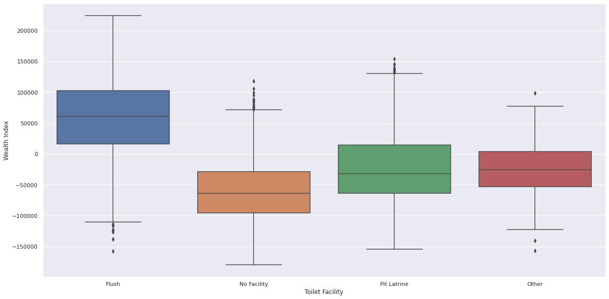

# WRI Creating a well-being data layer.

This project contains the code, papers and deliverables for the DSSG project *Creating a well-being data layer using machine learning, satellite imagery and ground-truth data*

In the long term, we are building a tool that can be extended to predict the wealth and economic factor of any given area in india.
More information on the architecture and implementation below.

# Table of contents

- [Project-Scope](#Project-Scope)
- [The Data](#The-Data)

  - [Demographic Health Survey](#Demographic-Health-Surveys)
  - [Open Street Maps Data](#Open-Street-Maps-Data)
  - [Night Time Light Data](#Night-Time-Light-Data)
- [Methodology](#Night-Time-Light-Data)

  - [Evaluation Strategy](#Evaluation-Strategy)
  - [Machine learning pipeline](#Machine-Learning-Pipeline)
- [Results](#Results)

  - [Conclusions](#Conclusions)
  - [Deliverables](#Deliverables)
  - [Future Work](#Future-Work)
- [Development](#development)

  - [Getting Started](#getting-started)
  - [Main Components](#main-components)
  - [Contribution Guidelines](#contribution-guidelines)
- [Project Organization](#Project-Organization)
- [Bibliography](#Bibliography)

## Project Scope

Conducting economic surveys requires huge resources; thus, modern means of acquiring this information using publicly available data and open source technologies create the possibilities of replacing current processes.
Satellite images can act as a proxy for existing data collection techniques such as surveys and census to predict the economic well-being of a region.

The aim of the project is to propose an alternative to Demographic Health Surveys using open source data such us Open Street Map, Sentinel and Night Light data.

## The Data

### Demographic Health Surveys

Demographic Health Surveys collect information on population, health, and nutrition for each state and union territory.
They are jointly funded by the United States Agency for International Development (USAID), the United Kingdom Department for International Development (DFID), the Bill and Melinda Gates Foundation (BMGF) and the United Nations. The datasets used in this project were obtained from the [dhsprogram](https://dhsprogram.com/) website.

The dataset was explored manually as well as through Pandas Profiling libary. While the dataset was found to be slightly skewed towards the poorest wealth class, variance between record counts lied within 1 standard deviation, warranting it as usable and eliminating the need for data balancing.

Box and whisker plots as well as Violin plots were used to make the following observations:

- Wealth fields i.e Wealth index and wealth class had almost a perfectly linear normal distribution (verfied by box-whisker graphs).
- Although population density was found to have a positive pearson correlation with wealth index, it was very weak and statistically insignificant  (0.223).
- Richer populations use flush-toilets (the box whisker was distinct from all others on the wealth axis)
- While the richer populations tend to use cement roofings, the distribution of materials is highly diffused. Hence a linear relation does not exist.
- Richer families are electrified.
- The choice of drinking water is highly diffused between the different mediums with no clear relation.
- Urban areas are wealthier than rural ones.

* Richer Families Have Electricity

* Richer Families Use Flush-Toilets

* Urban Areas Are Richer

All the images are available in images folder and in the [(DSSG/WRI) DHS Analysis.ipynb](./(DSSG_WRI)_DHS_Analysis.ipynb) notebook

The problem was identified to be non-linear and multivariate but highly inter-related.

### Open Street Maps Data

OpenStreetMap (OSM) is an open source project that crowd sources the world map and has made it available totally free of cost.
The data quality is generally seen as reliable although it varies across the world.

A python module [osm_data_extraction](./dssg/dataio/osm_data_extraction.py) was implemented to extract OSM data given the [GADM, Level 3](https://gadm.org/download_country_v3.html) shapefile and a district name. The module uses [OSMNx](https://github.com/gboeing/osmnx) which interacts with the OpenStreetMap's API to get the relevant data for a specific region and stores it in a csv file. An example usage of this module can be found in the notebook [araria_district.ipynb](./dssg/data-exploration/araria_district.ipynb).

For Minimum Viable Product purpose, data was downloaded only for the Bihar state of India.
The dataset contained important information like coordinates and counts of geographical landmarks like highways, hospitals and educational institutes.
The team posited these landmarks might indicate wealth of the region.

Due to computing resource constraint, the area of study was restricted to Araria district of Bihar state.
A disparity was noticed between the clusters in OSM dataset and DHS dataset. Clusters, not shared by both dataset, were removed.

### Night Time Light Data

Night time light data can highlight areas of greater economic activity as these regions tend to be reletively more lit.
Image data to proceed with this approach was obtained via Google Earth Engine (GEE).
GEE provides a quickly accessible collection of data images captured across timelines, light wavelenghts and satellite systems.
The data is open and free to use for non-commerical uses.

A python module [ntl_data_extraction](./dssg/dataio/ntl_data_extraction.py) and a command line app [download-nightlights](./dssg/apps/download-nightlights.py) were implemented to download the night light data for a given district and the date range. The implementation uses the [modapsclient](https://pypi.org/project/modapsclient/) , a RESTful client for NASA's MODIS Adaptive Processing System (MODAPS). The python module also implements a method to convert the hdf5 files to geotiff files for further processing. The team used NASA’s VIIRS/NPP LunarBRDF-Adjusted Nighttime Lights data. Lat-Lon grid setting was adjusted to 500m.

The data was explored but due to a pressing need of computational resources and time, the data was not integrated with the other data sources and hence not utilized for solution building. We also concluded that for future computations it would be better to use annual composites of the night light data sets to reduce the need for large amounts of computational resources.

The implementation of the osm_data_extraction and ntl_data_extraction modules would be crucial to scale the data processing pipeline for the rest of India or for any other country in the world.

## Project Methodology

### Evaluation Strategy

We tend to judge a model's generalization error by the gap between its performance in training and test.
For this matter its important to strategically partition a dataset in a way that resembles what happens on the desired production environment.
Due to the few samples in the dataset restrictions, we performed a Leave One Out evaluation (LOOCV).
Leave-one-out cross-validation, or LOOCV, is a configuration of k-fold cross-validation where k is set to the number of examples in the dataset.

LOOCV is a computationally expensive procedure to perform,
although it results in a reliable and unbiased estimate of model performance.

### Label Transformation.

The original wealth index provided by the DHS data, was a classification between 1-5 of the wealth level of a certain district.
`{1: Poorest  2: Poorer 3: Middle 4: Richer 5: Richest}`
This label even if at first might seem a multiclassification is a continuous feature that has been post procesed and binarized into categories.

We treat this problem as a regression task than then need to be binarized again in the post procesing part of the ML pipeline.
In the meanwhile we use the Mean Absolute Error as a intuitive evaluation metric.

We standarized the label to have it between [0-1], for sake of dimensionality.

In the above image, For the state Araria we can see the scaled label. 0 being poor and 1 rich.
There is a disctrict that has a higher wealth than the rest.

### Explainable Machine learning pipeline

Due to the possible impact of this project in public policy we advocate for an explainable ML approach.

For the modeling part a set of experiments to determine which  machine learning estimators was performed.
The selected estimator for this part of the project was a decision tree, due to its okey performance, in a small dataset. 
This model also allows us to understand how are the ML decisions made.

## Results

After preprocessing the data the following results were obtained.

In the difference of wealth distribution we can see where our model is achieving the best results and where its failing.
This visualization can help to gain trust in the model since metrics do not always give users. 

We can note in the heatmap that most of the error are between [0.1,0.2]%.
### Conclusions

Predictive Model that is:
1.  Open Source Data
2.  No cloud computing resources

Modeling remains explainable andaccountable while preserving accuracy
1. Explainable and Interpretable machine learning
2. Accountable. It should be possible to trace the logical reasons of why a decision was taken.  
3. High Generalization: Simple models tend to have a higher generalization than complex models [1]

### Deliverables
The project had following deliverables:

1. Project final [presentation](https://github.com/cmougan/WRI_WellBeing_Data_Layer/blob/master/Deliverables/Presentation.pdf)
2. A report with an extensive analyisis of the methodology followed.

## Future Work

Future WorkSteps:
1. Scale Up: Due to the computational resources limitation we ended up only working for one district of India. Its performance on state and national level remains to be evaluated.
2. Integrate with NTL: One further data integration that should be helpful is the Night Data, this data theoretically should improve the accuracy in areas where OSM data is scarce.
3. Temporal Evaluation: As the goal of the project, is to prevent what will happen on the future with forest, there is the need to ensure that the model will generalize as time goes by.

## Project Organization

### Solve For Good Collaborators

[Carlos Mougan](https://www.linkedin.com/in/carlosmougan/)

[Sunayana Ghosh](https://www.linkedin.com/in/sunayanag/)

[Gijs van den Dool](https://www.linkedin.com/in/gvddool/)

[Rohan Nadeem ](https://www.linkedin.com/in/rohaan-nadeem/)

### Word Resources Institute

[Rong Fang](https://www.linkedin.com/in/rongfang1/)

[Kathleen Buckingham](https://www.linkedin.com/in/kathleenbuckingham/)

### Omdena

[Rehab Emam](https://www.linkedin.com/in/rehabemam228/)

[Precioso Gabrillo](https://www.linkedin.com/in/precioso-gabrillo-iii/)
...

#### Bibliography

[1] Stop explaining black box machine learning models for high stakes decisions and use interpretable models instead: https://www.nature.com/articles/s42256-019-0048-x

